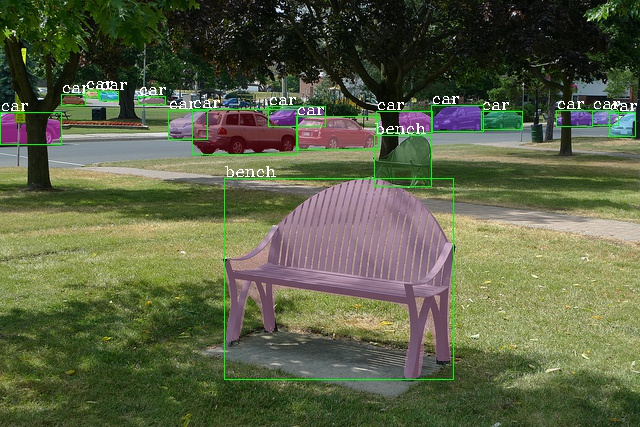

# MMDetection

**News**: We released the technical report on [ArXiv](https://arxiv.org/abs/1906.07155).

## Introduction

The master branch works with **PyTorch 1.1** or higher.

mmdetection is an open source object detection toolbox based on PyTorch. It is
a part of the open-mmlab project developed by [Multimedia Laboratory, CUHK](http://mmlab.ie.cuhk.edu.hk/).



### Major features

- **Modular Design**

  We decompose the detection framework into different components and one can easily construct a customized object detection framework by combining different modules.

- **Support of multiple frameworks out of box**

  The toolbox directly supports popular and contemporary detection frameworks, *e.g.* Faster RCNN, Mask RCNN, RetinaNet, etc.

- **High efficiency**

  All basic bbox and mask operations run on GPUs now. The training speed is faster than or comparable to other codebases, including [Detectron](https://github.com/facebookresearch/Detectron), [maskrcnn-benchmark](https://github.com/facebookresearch/maskrcnn-benchmark) and [SimpleDet](https://github.com/TuSimple/simpledet).

- **State of the art**

  The toolbox stems from the codebase developed by the *MMDet* team, who won [COCO Detection Challenge](http://cocodataset.org/#detection-leaderboard) in 2018, and we keep pushing it forward.

Apart from MMDetection, we also released a library [mmcv](https://github.com/open-mmlab/mmcv) for computer vision research, which is heavily depended on by this toolbox.

## License

This project is released under the [Apache 2.0 license](LICENSE).

## Updates

v1.0rc0 (27/07/2019)
- Implement lots of new methods and components (Mixed Precision Training, HTC, Libra R-CNN, Guided Anchoring, Empirical Attention, Mask Scoring R-CNN, Grid R-CNN (Plus), GHM, GCNet, FCOS, HRNet, Weight Standardization, etc.). Thank all collaborators!
- Support two additional datasets: WIDER FACE and Cityscapes.
- Refactoring for loss APIs and make it more flexible to adopt different losses and related hyper-parameters.
- Speed up multi-gpu testing.
- Integrate all compiling and installing in a single script.

v0.6.0 (14/04/2019)
- Up to 30% speedup compared to the model zoo.
- Support both PyTorch stable and nightly version.
- Replace NMS and SigmoidFocalLoss with Pytorch CUDA extensions.

v0.6rc0(06/02/2019)
- Migrate to PyTorch 1.0.

v0.5.7 (06/02/2019)
- Add support for Deformable ConvNet v2. (Many thanks to the authors and [@chengdazhi](https://github.com/chengdazhi))
- This is the last release based on PyTorch 0.4.1.

v0.5.6 (17/01/2019)
- Add support for Group Normalization.
- Unify RPNHead and single stage heads (RetinaHead, SSDHead) with AnchorHead.

v0.5.5 (22/12/2018)
- Add SSD for COCO and PASCAL VOC.
- Add ResNeXt backbones and detection models.
- Refactoring for Samplers/Assigners and add OHEM.
- Add VOC dataset and evaluation scripts.

v0.5.4 (27/11/2018)
- Add SingleStageDetector and RetinaNet.

v0.5.3 (26/11/2018)
- Add Cascade R-CNN and Cascade Mask R-CNN.
- Add support for Soft-NMS in config files.

v0.5.2 (21/10/2018)
- Add support for custom datasets.
- Add a script to convert PASCAL VOC annotations to the expected format.

v0.5.1 (20/10/2018)
- Add BBoxAssigner and BBoxSampler, the `train_cfg` field in config files are restructured.
- `ConvFCRoIHead` / `SharedFCRoIHead` are renamed to `ConvFCBBoxHead` / `SharedFCBBoxHead` for consistency.

## Benchmark and model zoo

Supported methods and backbones are shown in the below table.
Results and models are available in the [Model zoo](MODEL_ZOO.md).

|                    | ResNet   | ResNeXt  | SENet    | VGG      | HRNet |
|--------------------|:--------:|:--------:|:--------:|:--------:|:-----:|
| RPN                | ✓        | ✓        | ☐        | ✗        | ✓     |
| Fast R-CNN         | ✓        | ✓        | ☐        | ✗        | ✓     |
| Faster R-CNN       | ✓        | ✓        | ☐        | ✗        | ✓     |
| Mask R-CNN         | ✓        | ✓        | ☐        | ✗        | ✓     |
| Cascade R-CNN      | ✓        | ✓        | ☐        | ✗        | ✓     |
| Cascade Mask R-CNN | ✓        | ✓        | ☐        | ✗        | ✓     |
| SSD                | ✗        | ✗        | ✗        | ✓        | ✗     |
| RetinaNet          | ✓        | ✓        | ☐        | ✗        | ✓     |
| GHM                | ✓        | ✓        | ☐        | ✗        | ✓     |
| Mask Scoring R-CNN | ✓        | ✓        | ☐        | ✗        | ✓     |
| FCOS               | ✓        | ✓        | ☐        | ✗        | ✓     |
| Double-Head R-CNN  | ✓        | ✓        | ☐        | ✗        | ✓     |
| Grid R-CNN (Plus)  | ✓        | ✓        | ☐        | ✗        | ✓     |
| Hybrid Task Cascade| ✓        | ✓        | ☐        | ✗        | ✓     |
| Libra R-CNN        | ✓        | ✓        | ☐        | ✗        | ✓     |
| Guided Anchoring   | ✓        | ✓        | ☐        | ✗        | ✓     |

Other features
- [x] DCNv2
- [x] Group Normalization
- [x] Weight Standardization
- [x] OHEM
- [x] Soft-NMS
- [x] Generalized Attention
- [x] GCNet
- [x] Mixed Precision (FP16) Training


## Installation

Please refer to [INSTALL.md](INSTALL.md) for installation and dataset preparation.


## Get Started

Please see [GETTING_STARTED.md](GETTING_STARTED.md) for the basic usage of MMDetection.

## Contributing

We appreciate all contributions to improve MMDetection. Please refer to [CONTRIBUTING.md](CONTRIBUTING.md) for the contributing guideline.

## Acknowledgement

MMDetection is an open source project that is contributed by researchers and engineers from various colleges and companies. We appreciate all the contributors who implement their methods or add new features, as well as users who give valuable feedbacks.
We wish that the toolbox and benchmark could serve the growing research community by providing a flexible toolkit to reimplement existing methods and develop their own new detectors.


## Citation

If you use this toolbox or benchmark in your research, please cite this project.

```
@article{mmdetection,
  title   = {{MMDetection}: Open MMLab Detection Toolbox and Benchmark},
  author  = {Chen, Kai and Wang, Jiaqi and Pang, Jiangmiao and Cao, Yuhang and
             Xiong, Yu and Li, Xiaoxiao and Sun, Shuyang and Feng, Wansen and
             Liu, Ziwei and Xu, Jiarui and Zhang, Zheng and Cheng, Dazhi and
             Zhu, Chenchen and Cheng, Tianheng and Zhao, Qijie and Li, Buyu and
             Lu, Xin and Zhu, Rui and Wu, Yue and Dai, Jifeng and Wang, Jingdong
             and Shi, Jianping and Ouyang, Wanli and Loy, Chen Change and Lin, Dahua},
  journal= {arXiv preprint arXiv:1906.07155},
  year={2019}
}
```


## Contact

This repo is currently maintained by Kai Chen ([@hellock](http://github.com/hellock)), Jiangmiao Pang ([@OceanPang](https://github.com/OceanPang)), Jiaqi Wang ([@myownskyW7](https://github.com/myownskyW7)) and Yuhang Cao ([@yhcao6](https://github.com/yhcao6)).