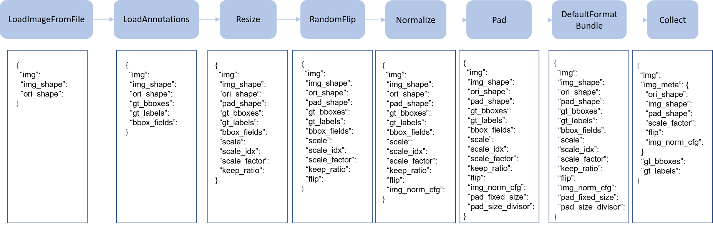

# Technical Details

In this section, we will introduce the main units of training a detector:
data pipeline, model and iteration pipeline.

## Data pipeline

Following typical conventions, we use `Dataset` and `DataLoader` for data loading
with multiple workers. `Dataset` returns a dict of data items corresponding
the arguments of models' forward method.
Since the data in object detection may not be the same size (image size, gt bbox size, etc.),
we introduce a new `DataContainer` type in MMCV to help collect and distribute
data of different size.
See [here](https://github.com/open-mmlab/mmcv/blob/master/mmcv/parallel/data_container.py) for more details.

The data preparation pipeline and the dataset is decomposed. Usually a dataset
defines how to process the annotations and a data pipeline defines all the steps to prepare a data dict.
A pipeline consists of a sequence of operations. Each operation takes a dict as input and also output a dict for the next transform.

We present a classical pipeline in the following figure. The blue blocks are pipeline operations. With the pipeline going on, each operator can add new keys (marked as green) to the result dict or update the existing keys (marked as orange).


The operations are categorized into data loading, pre-processing, formatting and test-time augmentation.

Here is an pipeline example for Faster R-CNN.
```python
img_norm_cfg = dict(
    mean=[123.675, 116.28, 103.53], std=[58.395, 57.12, 57.375], to_rgb=True)
train_pipeline = [
    dict(type='LoadImageFromFile'),
    dict(type='LoadAnnotations', with_bbox=True),
    dict(type='Resize', img_scale=(1333, 800), keep_ratio=True),
    dict(type='RandomFlip', flip_ratio=0.5),
    dict(type='Normalize', **img_norm_cfg),
    dict(type='Pad', size_divisor=32),
    dict(type='DefaultFormatBundle'),
    dict(type='Collect', keys=['img', 'gt_bboxes', 'gt_labels']),
]
test_pipeline = [
    dict(type='LoadImageFromFile'),
    dict(
        type='MultiScaleFlipAug',
        img_scale=(1333, 800),
        flip=False,
        transforms=[
            dict(type='Resize', keep_ratio=True),
            dict(type='RandomFlip'),
            dict(type='Normalize', **img_norm_cfg),
            dict(type='Pad', size_divisor=32),
            dict(type='ImageToTensor', keys=['img']),
            dict(type='Collect', keys=['img']),
        ])
]
```

For each operation, we list the related dict fields that are added/updated/removed.

### Data loading

`LoadImageFromFile`
- add: img, img_shape, ori_shape

`LoadAnnotations`
- add: gt_bboxes, gt_bboxes_ignore, gt_labels, gt_masks, gt_semantic_seg, bbox_fields, mask_fields

`LoadProposals`
- add: proposals

### Pre-processing

`Resize`
- add: scale, scale_idx, pad_shape, scale_factor, keep_ratio
- update: img, img_shape, *bbox_fields, *mask_fields, *seg_fields

`RandomFlip`
- add: flip
- update: img, *bbox_fields, *mask_fields, *seg_fields

`Pad`
- add: pad_fixed_size, pad_size_divisor
- update: img, pad_shape, *mask_fields, *seg_fields

`RandomCrop`
- update: img, pad_shape, gt_bboxes, gt_labels, gt_masks, *bbox_fields

`Normalize`
- add: img_norm_cfg
- update: img

`SegRescale`
- update: gt_semantic_seg

`PhotoMetricDistortion`
- update: img

`Expand`
- update: img, gt_bboxes

`MinIoURandomCrop`
- update: img, gt_bboxes, gt_labels

`Corrupt`
- update: img

### Formatting

`ToTensor`
- update: specified by `keys`.

`ImageToTensor`
- update: specified by `keys`.

`Transpose`
- update: specified by `keys`.

`ToDataContainer`
- update: specified by `fields`.

`DefaultFormatBundle`
- update: img, proposals, gt_bboxes, gt_bboxes_ignore, gt_labels, gt_masks, gt_semantic_seg

`Collect`
- add: img_meta (the keys of img_meta is specified by `meta_keys`)
- remove: all other keys except for those specified by `keys`

### Test time augmentation

`MultiScaleFlipAug`

## Model

In MMDetection, model components are basically categorized as 4 types.

- backbone: usually a FCN network to extract feature maps, e.g., ResNet.
- neck: the part between backbones and heads, e.g., FPN, ASPP.
- head: the part for specific tasks, e.g., bbox prediction and mask prediction.
- roi extractor: the part for extracting features from feature maps, e.g., RoI Align.

We also write implement some general detection pipelines with the above components,
such as `SingleStageDetector` and `TwoStageDetector`.

### Build a model with basic components

Following some basic pipelines (e.g., two-stage detectors), the model structure
can be customized through config files with no pains.

If we want to implement some new components, e.g, the path aggregation
FPN structure in [Path Aggregation Network for Instance Segmentation](https://arxiv.org/abs/1803.01534), there are two things to do.

1. create a new file in `mmdet/models/necks/pafpn.py`.

    ```python
    from ..registry import NECKS

    @NECKS.register
    class PAFPN(nn.Module):

        def __init__(self,
                    in_channels,
                    out_channels,
                    num_outs,
                    start_level=0,
                    end_level=-1,
                    add_extra_convs=False):
            pass

        def forward(self, inputs):
            # implementation is ignored
            pass
    ```

2. Import the module in `mmdet/models/necks/__init__.py`.

    ```python
    from .pafpn import PAFPN
    ```

2. modify the config file from

    ```python
    neck=dict(
        type='FPN',
        in_channels=[256, 512, 1024, 2048],
        out_channels=256,
        num_outs=5)
    ```

    to

    ```python
    neck=dict(
        type='PAFPN',
        in_channels=[256, 512, 1024, 2048],
        out_channels=256,
        num_outs=5)
    ```

We will release more components (backbones, necks, heads) for research purpose.

### Write a new model

To write a new detection pipeline, you need to inherit from `BaseDetector`,
which defines the following abstract methods.

- `extract_feat()`: given an image batch of shape (n, c, h, w), extract the feature map(s).
- `forward_train()`: forward method of the training mode
- `simple_test()`: single scale testing without augmentation
- `aug_test()`: testing with augmentation (multi-scale, flip, etc.)

[TwoStageDetector](https://github.com/hellock/mmdetection/blob/master/mmdet/models/detectors/two_stage.py)
is a good example which shows how to do that.

## Iteration pipeline

We adopt distributed training for both single machine and multiple machines.
Supposing that the server has 8 GPUs, 8 processes will be started and each process runs on a single GPU.

Each process keeps an isolated model, data loader, and optimizer.
Model parameters are only synchronized once at the beginning.
After a forward and backward pass, gradients will be allreduced among all GPUs,
and the optimizer will update model parameters.
Since the gradients are allreduced, the model parameter stays the same for all processes after the iteration.

## Other information

For more information, please refer to our [technical report](https://arxiv.org/abs/1906.07155).
