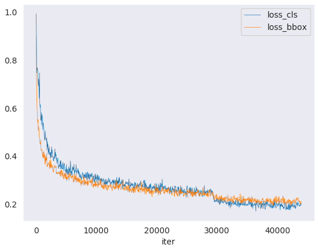

# Getting Started

This page provides basic tutorials about the usage of OTEDetection.
For installation instructions, please see [install.md](install.md).

# Table of contents

- [Prepare datasets](#prepare-datasets)
- [Export pretrained model to ONNX and OpenVINO IR](#export-pretrained-model-to-onnx-and-openvino-ir)
- [Inference with pretrained models](#inference-with-pretrained-models)
  - [Test using PyTorch](#test-using-pytorch)
  - [Test using OpenVINO or ONNXRuntime](#test-using-openvino-or-onnxruntime)
  - [Image demo](#image-demo)
  - [Webcam demo](#webcam-demo)
- [Train a model](#train-a-model)
  - [Train with a single GPU](#train-with-a-single-gpu)
  - [Train with multiple GPUs](#train-with-multiple-gpus)
  - [Train with multiple machines](#train-with-multiple-machines)
  - [Launch multiple jobs on a single machine](#launch-multiple-jobs-on-a-single-machine)
- [Useful tools](#useful-tools)
  - [Analyze logs](#analyze-logs)
  - [Get the FLOPs and params (experimental)](#get-the-flops-and-params-experimental)
  - [Publish a model](#publish-a-model)
  - [Test the robustness of detectors](#test-the-robustness-of-detectors)
- [Tutorials](#tutorials)


## Prepare datasets

It is recommended to symlink the dataset root to `./data`.
If your folder structure is different, you may need to change the corresponding paths in config files.

```
mmdetection
├── mmdet
├── tools
├── configs
├── data
│   ├── coco
│   │   ├── annotations
│   │   ├── train2017
│   │   ├── val2017
│   │   ├── test2017
│   ├── cityscapes
│   │   ├── annotations
│   │   ├── leftImg8bit
│   │   │   ├── train
│   │   │   ├── val
│   │   ├── gtFine
│   │   │   ├── train
│   │   │   ├── val
│   ├── VOCdevkit
│   │   ├── VOC2007
│   │   ├── VOC2012

```

The cityscapes annotations have to be converted into the coco format using `tools/convert_datasets/cityscapes.py`:

```shell
pip install cityscapesscripts
python tools/convert_datasets/cityscapes.py ./data/cityscapes --nproc 8 --out-dir ./data/cityscapes/annotations
```

Currently the config files in `cityscapes` use COCO pre-trained weights to initialize.
You could download the pre-trained models in advance if network is unavailable or slow, otherwise it would cause errors at the beginning of training.

For using custom datasets, please refer to [Tutorials 2: Adding New Dataset](tutorials/new_dataset.md).

## Export pretrained model to ONNX and OpenVINO IR

To export pretrained model to ONNX format run the script:

```shell
python tools/export.py config.py checkpoint.pth ${DEPLOY_DIR} onnx
```

To export pretrained model to OpenVINO IR format run the script:

```shell
python tools/export.py config.py checkpoint.pth ${DEPLOY_DIR} openvino
```

OpenVINO exports models with a fixed input resolution. The script tries to derive it
from data preprocessing pipeline config, though some of preprocessing steps may be data-dependent
making it hard to come up with a right resolution.
In this case, or if you simply want to use resolution different from the one used in test config,
specify target resolution explicitly via `--input_shape` option.

For SSD networks there's an alternative model representation that contains higher level custom operations,
which make it easier to analyse the model and enable heavier optimizations,
but this may come at a cost of a small accuracy drop.
To opt for this model representation use `--alt_ssd_export` option.

**KNOWN ISSUES**:

* Not all models are currently exportable.

* Before running the script make sure that all OpenVINO-related environment variables are set properly.
  To do this run the following command:

  ```shell
  source /opt/intel/openvino_2021/bin/setupvars.sh
  ```

## Inference with pretrained models

We provide testing scripts to evaluate a whole dataset (COCO, PASCAL VOC, Cityscapes, etc.),
and also some high-level apis for easier integration to other projects.

### Test using PyTorch

- single GPU
- single node multiple GPU
- multiple node

You can use the following commands to test a dataset.

```shell
# single-gpu testing
python tools/test.py ${CONFIG_FILE} ${CHECKPOINT_FILE} [--out ${RESULT_FILE}] [--eval ${EVAL_METRICS}] [--show]

# multi-gpu testing
./tools/dist_test.sh ${CONFIG_FILE} ${CHECKPOINT_FILE} ${GPU_NUM} [--out ${RESULT_FILE}] [--eval ${EVAL_METRICS}]
```

Optional arguments:
- `RESULT_FILE`: Filename of the output results in pickle format. If not specified, the results will not be saved to a file.
- `EVAL_METRICS`: Items to be evaluated on the results. Allowed values depend on the dataset, e.g., `proposal_fast`, `proposal`, `bbox`, `segm` are available for COCO, `mAP`, `recall` for PASCAL VOC. Cityscapes could be evaluated by `cityscapes` as well as all COCO metrics.
- `--show`: If specified, detection results will be plotted on the images and shown in a new window. It is only applicable to single GPU testing and used for debugging and visualization. Please make sure that GUI is available in your environment, otherwise you may encounter the error like `cannot connect to X server`.
- `--show-dir`: If specified, detection results will be plotted on the images and saved to the specified directory. It is only applicable to single GPU testing and used for debugging and visualization. You do NOT need a GUI available in your environment for using this option.
- `--show-score-thr`: If specified, detections with score below this threshold will be removed.


Examples:

Assume that you have already downloaded the checkpoints to the directory `checkpoints/`.

1. Test Faster R-CNN and visualize the results. Press any key for the next image.

```shell
python tools/test.py configs/faster_rcnn_r50_fpn_1x_coco.py \
    checkpoints/faster_rcnn_r50_fpn_1x_20181010-3d1b3351.pth \
    --show
```

2. Test Faster R-CNN and save the painted images for latter visualization.

```shell
python tools/test.py configs/faster_rcnn_r50_fpn_1x.py \
    checkpoints/faster_rcnn_r50_fpn_1x_20181010-3d1b3351.pth \
    --show-dir faster_rcnn_r50_fpn_1x_results
```

3. Test Faster R-CNN on PASCAL VOC (without saving the test results) and evaluate the mAP.

```shell
python tools/test.py configs/pascal_voc/faster_rcnn_r50_fpn_1x_voc.py \
    checkpoints/SOME_CHECKPOINT.pth \
    --eval mAP
```

4. Test Mask R-CNN with 8 GPUs, and evaluate the bbox and mask AP.

```shell
./tools/dist_test.sh configs/mask_rcnn_r50_fpn_1x_coco.py \
    checkpoints/mask_rcnn_r50_fpn_1x_20181010-069fa190.pth \
    8 --out results.pkl --eval bbox segm
```

5. Test Mask R-CNN with 8 GPUs, and evaluate the **classwise** bbox and mask AP.

```shell
./tools/dist_test.sh configs/mask_rcnn_r50_fpn_1x_coco.py \
    checkpoints/mask_rcnn_r50_fpn_1x_20181010-069fa190.pth \
    8 --out results.pkl --eval bbox segm --options "classwise=True"
```

6. Test Mask R-CNN on COCO test-dev with 8 GPUs, and generate the json file to be submit to the official evaluation server.

```shell
./tools/dist_test.sh configs/mask_rcnn_r50_fpn_1x_coco.py \
    checkpoints/mask_rcnn_r50_fpn_1x_20181010-069fa190.pth \
    8 --format-only --options "jsonfile_prefix=./mask_rcnn_test-dev_results"
```

You will get two json files `mask_rcnn_test-dev_results.bbox.json` and `mask_rcnn_test-dev_results.segm.json`.

7. Test Mask R-CNN on Cityscapes test with 8 GPUs, and generate the txt and png files to be submit to the official evaluation server.

```shell
./tools/dist_test.sh configs/cityscapes/mask_rcnn_r50_fpn_1x_cityscapes.py \
    checkpoints/mask_rcnn_r50_fpn_1x_cityscapes_20200227-afe51d5a.pth \
    8  --format-only --options "txtfile_prefix=./mask_rcnn_cityscapes_test_results"
```

The generated png and txt would be under `./mask_rcnn_cityscapes_test_results` directory.

### Test using OpenVINO or ONNXRuntime

You can test the model being exported via the `tools/export.py` script by simply switching the `tools/test.py` script with a `tools/test_exported.py`.

```shell
# test with OpenVINO
python tools/test_exported.py config.py ${DEPLOY_DIR}/checkpoint.xml [--out ${RESULT_FILE}] [--eval ${EVAL_METRICS}] [--show]

# test with ONNXRuntime
python tools/test_exported.py config.py ${DEPLOY_DIR}/checkpoint.onnx [--out ${RESULT_FILE}] [--eval ${EVAL_METRICS}] [--show]
```

### Image demo

We provide a demo script to test a single image.

```shell
python demo/image_demo.py ${IMAGE_FILE} ${CONFIG_FILE} ${CHECKPOINT_FILE} [--device ${GPU_ID}] [--score-thr ${SCORE_THR}]
```

Examples:

```shell
python demo/image_demo.py demo/demo.jpg configs/faster_rcnn_r50_fpn_1x_coco.py \
    checkpoints/faster_rcnn_r50_fpn_1x_20181010-3d1b3351.pth --device cpu
```

### Webcam demo

We provide a webcam demo to illustrate the results.

```shell
python demo/webcam_demo.py ${CONFIG_FILE} ${CHECKPOINT_FILE} [--device ${GPU_ID}] [--camera-id ${CAMERA-ID}] [--score-thr ${SCORE_THR}]
```

Examples:

```shell
python demo/webcam_demo.py configs/faster_rcnn_r50_fpn_1x_coco.py \
    checkpoints/faster_rcnn_r50_fpn_1x_20181010-3d1b3351.pth
```

## Train a model

Both distributed training and non-distributed training modes are available,
which use `MMDistributedDataParallel` and `MMDataParallel` respectively.

All outputs (log files and checkpoints) will be saved to the working directory,
which is specified by `work_dir` in the config file.

By default we evaluate the model on the validation set after each epoch, you can change the evaluation interval by adding the interval argument in the training config.
```python
evaluation = dict(interval=12)  # This evaluate the model per 12 epoch.
```

**\*Important\***: The default learning rate in config files is for 8 GPUs and 2 img/gpu (batch size = 8*2 = 16).
According to the [Linear Scaling Rule](https://arxiv.org/abs/1706.02677), you need to set the learning rate proportional to the batch size if you use different GPUs or images per GPU, e.g., lr=0.01 for 4 GPUs * 2 img/gpu and lr=0.08 for 16 GPUs * 4 img/gpu.

### Train with a single GPU

```shell
python tools/train.py ${CONFIG_FILE} [optional arguments]
```

If you want to specify the working directory in the command, you can add an argument `--work_dir ${YOUR_WORK_DIR}`.

### Train with multiple GPUs

```shell
./tools/dist_train.sh ${CONFIG_FILE} ${GPU_NUM} [optional arguments]
```

Optional arguments are:

- `--no-validate` (**not suggested**): By default, the codebase will perform evaluation at every k (default value is 1, which can be modified like [this](https://github.com/open-mmlab/mmdetection/blob/master/configs/mask_rcnn/mask_rcnn_r50_fpn_1x_coco.py#L174)) epochs during the training. To disable this behavior, use `--no-validate`.
- `--work-dir ${WORK_DIR}`: Override the working directory specified in the config file.
- `--resume-from ${CHECKPOINT_FILE}`: Resume from a previous checkpoint file.

Difference between `resume-from` and `load-from`:
`resume-from` loads both the model weights and optimizer status, and the epoch is also inherited from the specified checkpoint. It is usually used for resuming the training process that is interrupted accidentally.
`load-from` only loads the model weights and the training epoch starts from 0. It is usually used for finetuning.

### Train with multiple machines

If you run OTEDetection on a cluster managed with [slurm](https://slurm.schedmd.com/), you can use the script `slurm_train.sh`. (This script also supports single machine training.)

```shell
[GPUS=${GPUS}] ./tools/slurm_train.sh ${PARTITION} ${JOB_NAME} ${CONFIG_FILE} ${WORK_DIR}
```

Here is an example of using 16 GPUs to train Mask R-CNN on the dev partition.

```shell
GPUS=16 ./tools/slurm_train.sh dev mask_r50_1x configs/mask_rcnn_r50_fpn_1x_coco.py /nfs/xxxx/mask_rcnn_r50_fpn_1x
```

You can check [slurm_train.sh](../tools/slurm_train.sh) for full arguments and environment variables.

If you have just multiple machines connected with ethernet, you can refer to
PyTorch [launch utility](https://pytorch.org/docs/stable/distributed_deprecated.html#launch-utility).
Usually it is slow if you do not have high speed networking like InfiniBand.

### Launch multiple jobs on a single machine

If you launch multiple jobs on a single machine, e.g., 2 jobs of 4-GPU training on a machine with 8 GPUs,
you need to specify different ports (29500 by default) for each job to avoid communication conflict.

If you use `dist_train.sh` to launch training jobs, you can set the port in commands.

```shell
CUDA_VISIBLE_DEVICES=0,1,2,3 PORT=29500 ./tools/dist_train.sh ${CONFIG_FILE} 4
CUDA_VISIBLE_DEVICES=4,5,6,7 PORT=29501 ./tools/dist_train.sh ${CONFIG_FILE} 4
```

If you use launch training jobs with Slurm, you need to modify the config files (usually the 6th line from the bottom in config files) to set different communication ports.

In `config1.py`,
```python
dist_params = dict(backend='nccl', port=29500)
```

In `config2.py`,
```python
dist_params = dict(backend='nccl', port=29501)
```

Then you can launch two jobs with `config1.py` ang `config2.py`.

```shell
CUDA_VISIBLE_DEVICES=0,1,2,3 GPUS=4 ./tools/slurm_train.sh ${PARTITION} ${JOB_NAME} config1.py ${WORK_DIR}
CUDA_VISIBLE_DEVICES=4,5,6,7 GPUS=4 ./tools/slurm_train.sh ${PARTITION} ${JOB_NAME} config2.py ${WORK_DIR}
```

## Useful tools

We provide lots of useful tools under `tools/` directory.

### Analyze logs

You can plot loss/mAP curves given a training log file. Run `pip install seaborn` first to install the dependency.



```shell
python tools/analyze_logs.py plot_curve [--keys ${KEYS}] [--title ${TITLE}] [--legend ${LEGEND}] [--backend ${BACKEND}] [--style ${STYLE}] [--out ${OUT_FILE}]
```

Examples:

- Plot the classification loss of some run.

```shell
python tools/analyze_logs.py plot_curve log.json --keys loss_cls --legend loss_cls
```

- Plot the classification and regression loss of some run, and save the figure to a pdf.

```shell
python tools/analyze_logs.py plot_curve log.json --keys loss_cls loss_bbox --out losses.pdf
```

- Compare the bbox mAP of two runs in the same figure.

```shell
python tools/analyze_logs.py plot_curve log1.json log2.json --keys bbox_mAP --legend run1 run2
```

You can also compute the average training speed.

```shell
python tools/analyze_logs.py cal_train_time log.json [--include-outliers]
```

The output is expected to be like the following.

```
-----Analyze train time of work_dirs/some_exp/20190611_192040.log.json-----
slowest epoch 11, average time is 1.2024
fastest epoch 1, average time is 1.1909
time std over epochs is 0.0028
average iter time: 1.1959 s/iter

```

### Get the FLOPs and params (experimental)

We provide a script adapted from [flops-counter.pytorch](https://github.com/sovrasov/flops-counter.pytorch) to compute the FLOPs and params of a given model.

```shell
python tools/get_flops.py ${CONFIG_FILE} [--shape ${INPUT_SHAPE}]
```

You will get the result like this.

```
==============================
Input shape: (3, 1280, 800)
Flops: 239.32 GMac
Params: 37.74 M
==============================
```

**Note**: This tool is still experimental and we do not guarantee that the number is correct. You may well use the result for simple comparisons, but double check it before you adopt it in technical reports or papers.

(1) FLOPs are related to the input shape while parameters are not. The default input shape is (1, 3, 1280, 800).
(2) Some operators are not counted into FLOPs like GN and custom operators.
You can add support for new operators by modifying [`mmdet/utils/flops_counter.py`](../mmdet/utils/flops_counter.py).
(3) The FLOPs of two-stage detectors is dependent on the number of proposals.

### Publish a model

Before you upload a model to AWS, you may want to
(1) convert model weights to CPU tensors, (2) delete the optimizer states and
(3) compute the hash of the checkpoint file and append the hash id to the filename.

```shell
python tools/publish_model.py ${INPUT_FILENAME} ${OUTPUT_FILENAME}
```

E.g.,

```shell
python tools/publish_model.py work_dirs/faster_rcnn/latest.pth faster_rcnn_r50_fpn_1x_20190801.pth
```

The final output filename will be `faster_rcnn_r50_fpn_1x_20190801-{hash id}.pth`.

### Test the robustness of detectors

Please refer to [robustness_benchmarking.md](robustness_benchmarking.md).


## Tutorials

Currently, we provide four tutorials for users to [finetune models](tutorials/finetune.md), [add new dataset](tutorials/new_dataset.md), [design data pipeline](tutorials/data_pipeline.md) and [add new modules](tutorials/new_modules.md).
We also provide a full description about the [config system](config.md).
